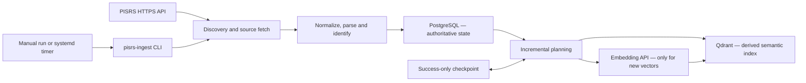

# OpenLegalCore Slovenian Legislation Ingest (PISRS)

`pisrs-ingest` is the Slovenian legislation-ingest component of
[OpenLegalCore](https://github.com/OpenLegalCore). It discovers legislation metadata and
consolidated-text versions from PISRS, stores authoritative structured state in PostgreSQL,
creates deterministic article-aware chunks, obtains embeddings when required, and maintains
the derived `pisrs_current` collection in Qdrant.

It is a focused ingestion and integrity-maintenance utility. It is not a search product, a
chatbot, a legal-analysis engine, or a user interface.

> [!IMPORTANT]
> This is an independent project. It is not an official PISRS project and is not affiliated
> with, endorsed by, or operated by the Republic of Slovenia or any Slovenian public authority.
> The software does not include PISRS credentials, PISRS data, or legislative text.

## Contents

- [What this component does](#what-this-component-does)
- [Current status](#current-status)
- [Quick start](#quick-start)
- [External services and credentials](#external-services-and-credentials)
- [PostgreSQL and Qdrant bootstrap](#postgresql-and-qdrant-bootstrap)
- [Installation and build](#installation-and-build)
- [Configuration](#configuration)
- [Read-only preflight](#read-only-preflight)
- [First controlled run](#first-controlled-run)
- [Nightly deployment](#nightly-deployment)
- [Advanced operations and internals](#advanced-operations-and-internals)
- [Troubleshooting](#troubleshooting)
- [Security and data responsibilities](#security-and-data-responsibilities)
- [License](#license)

## What this component does

The normal data path is:



The component provides:

- complete discovery of PISRS act and consolidated-text (`NPB`) catalogs;
- fetching and parsing of selected consolidated legislative text;
- stable act, document, block, article, chunk, and vector identities;
- idempotent PostgreSQL synchronization in the existing `pisrs` schema;
- article-aware text chunking and controlled embedding generation;
- maintenance of the derived Qdrant `pisrs_current` collection;
- checkpointed incremental execution;
- read-only and payload-only Qdrant reconciliation; and
- a small CLI for supervised or scheduled operation.

It deliberately does **not** provide:

- PostgreSQL or Qdrant provisioning;
- PISRS or embedding-provider accounts;
- a retrieval API, ranking engine, legal-analysis engine, or user interface;
- OCR or case-law ingestion;
- legal advice, interpretation, or citation validation; or
- automatic deletion of unexpected Qdrant points or payload keys.

The wider Slovenian component map is maintained in the
[`OpenLegalCore/slovenia`](https://github.com/OpenLegalCore/slovenia) architecture hub.

## Current status

- Package and release candidate: **v0.1.0**.
- Engineering status: **production-verified**.
- Publication status: **public source-available release since 21 August 2026**.
- License status: **source-available under BUSL-1.1 before the applicable Change Date**.

The complete pipeline passed controlled production acceptance on 19 August 2026. The accepted
path covered source discovery and fetch, PostgreSQL persistence, embeddings, Qdrant vector and
payload writes, idempotent repetition, success-only checkpoint advancement, payload-only
reconciliation, a supervised nightly run, a timer-triggered nightly run, and full
PostgreSQL/Qdrant reconciliation.

That result verifies the reviewed deployment and its fixed contracts. It is not a claim that
every PostgreSQL or Qdrant version, third-party infrastructure layout, source entitlement, or
embedding provider is automatically compatible.

## Quick start

This quick start validates an installation against **already compatible** PostgreSQL and Qdrant
targets. It intentionally stops at a read-only preflight. Do not run `nightly` until you have
reviewed the first-run checklist below.

### 1. Install the toolchain

You need Linux, Git, [`uv`](https://docs.astral.sh/uv/), and CPython 3.12:

```bash
git clone https://github.com/OpenLegalCore/slovenia-pisrs-ingest.git
cd slovenia-pisrs-ingest
uv python install 3.12
uv sync --locked --no-dev
uv run pisrs-ingest --help
```

### 2. Create a private local environment file

```bash
cp .env.example .env.local
chmod 600 .env.local
${EDITOR:-vi} .env.local
```

`.env.local` is ignored by Git. Replace every placeholder. The application does not load dotenv
files itself, so export the reviewed values in your shell or provide them through your service
manager:

```bash
set -a
. ./.env.local
set +a
```

Keep both authorization flags at `0` for setup and preflight.

For a non-systemd local preflight, use an ignored writable state directory instead of the
production `/var/lib` and `/run` paths from the example:

```bash
mkdir -p state
export PISRS_CHECKPOINT_PATH="$PWD/state/checkpoint.json"
export PISRS_LOCK_PATH="$PWD/state/ingest.lock"
```

### 3. Verify the external targets without writes

```bash
PISRS_ALLOW_EXTERNAL_API=0 \
PISRS_ALLOW_WRITES=0 \
uv run pisrs-ingest preflight
```

A successful preflight exits `0`, prints one JSON result, reports `writes: 0` and
`embedding_calls: 0`, and identifies the PISRS probe as `skipped_by_policy`.

If preflight fails, fix the reported contract mismatch. Do not bypass it and do not enable write
flags merely to test connectivity.

## External services and credentials

No credential is bundled with this repository, a source distribution, a wheel, a database
snapshot, or an OpenLegalCore website.

| Dependency | Required operator action | Configuration |
| --- | --- | --- |
| PISRS API | Obtain your own API access and token directly from the PISRS operator under its current access procedure and terms. OpenLegalCore cannot issue, transfer, or guarantee this credential. | `PISRS_PORTAL_BASE_URL`, `PISRS_API_TOKEN` |
| Embedding API | Create and fund your own compatible provider account. v0.1.0 is pinned to OpenAI-compatible `text-embedding-3-large` with 3,072 dimensions. | `OPENAI_BASE_URL`, `OPENAI_API_KEY` |
| PostgreSQL | Operate your own database and credentials. The DSN database must equal the explicit expected database and `current_database()`. | `PISRS_DATABASE_DSN`, `PISRS_EXPECTED_DATABASE` |
| Qdrant | Operate your own compatible Qdrant endpoint and collection. | `PISRS_QDRANT_URL`, `PISRS_QDRANT_COLLECTION` |

PISRS access and data-use conditions are independent of the software license in this repository.
You are responsible for confirming that your source access, processing, storage, redistribution,
and downstream use comply with the applicable PISRS terms and law.

## PostgreSQL and Qdrant bootstrap

### Supported starting states

v0.1.0 supports either of these operator-provided starting states:

1. an existing PostgreSQL database with the compatible `pisrs` schema and an existing compatible
   Qdrant collection; or
2. a PostgreSQL/Qdrant state restored from a future matching `slovenia-database` snapshot release.

This repository does not currently ship schema migrations, create a database, create service
accounts, or create the Qdrant collection. Until a compatible bootstrap artifact or snapshot is
published, a completely empty deployment is **not** a supported quick-start path.

### Fixed Qdrant contract

The configured collection name must be:

```text
pisrs_current
```

The collection must use:

```text
vector size: 3072
distance:    Cosine
model:       text-embedding-3-large
```

Changing the model, dimensions, collection identity, or point-identity algorithm requires a
separately controlled full reindex. Do not point v0.1.0 at an unrelated collection.

### Compatibility rule

Treat the software version, PostgreSQL schema, Qdrant payload/vector contract, and snapshot
manifest as one compatibility set. Run `preflight` after every restore, upgrade, endpoint change,
or credential rotation and before any mutating command.

## Installation and build

### Locked development environment

```bash
uv sync --locked --all-extras
uv lock --check
```

### Locked runtime environment

```bash
uv sync --locked --no-dev
```

Do not regenerate `uv.lock` as a side effect of installation.

### Verification

```bash
uv run ruff format --check --no-cache .
uv run ruff check --no-cache .
uv run pytest
```

### Build wheel and source distribution

```bash
build_output="$(mktemp -d)"
uv run python -m build --no-isolation --outdir "$build_output"
ls -l "$build_output"
```

Use a new output directory and verify the produced wheel and source archive before deployment. Do
not deploy an unverified or stale local `dist/` directory.

## Configuration

Copy [`.env.example`](.env.example) to a private file outside the repository for production. Every
value required by the selected command is validated before adapters open. There are no runtime
fallback credentials, service URLs, database identities, paths, or mutation permissions.

| Variable | Used by | Purpose |
| --- | --- | --- |
| `PISRS_DATABASE_DSN` | all commands | PostgreSQL DSN with a host and database. Keep it secret. |
| `PISRS_EXPECTED_DATABASE` | all commands | Credential-free database identity checked against the DSN and server. |
| `PISRS_QDRANT_URL` | all commands | Credential-free Qdrant HTTP(S) base URL. |
| `PISRS_QDRANT_COLLECTION` | all commands | Must be `pisrs_current`. |
| `PISRS_LOCK_PATH` | all commands | Absolute path shared by mutating commands. |
| `PISRS_RECONCILE_MAX_CHANGES` | all commands | Positive cap for a fully materialized reconcile plan. |
| `PISRS_ALLOW_EXTERNAL_API` | all commands | Strict `0` or `1`; `nightly` requires `1`. |
| `PISRS_ALLOW_WRITES` | all commands | Strict `0` or `1`; preflight requires `0`. |
| `PISRS_PORTAL_BASE_URL` | preflight, nightly | Credential-free HTTPS PISRS API base URL. |
| `PISRS_API_TOKEN` | preflight, nightly | Private PISRS bearer token. |
| `OPENAI_BASE_URL` | preflight, nightly | Credential-free HTTPS embedding API base URL. |
| `OPENAI_API_KEY` | preflight, nightly | Private embedding-provider key. |
| `PISRS_EMBEDDING_MODEL` | preflight, nightly | Must be `text-embedding-3-large`. |
| `PISRS_EMBEDDING_DIMENSIONS` | preflight, nightly | Must be `3072`. |
| `PISRS_CHECKPOINT_PATH` | preflight, nightly | Absolute path to the atomic JSON checkpoint. |
| `PISRS_INITIAL_SINCE` | preflight, nightly | Timezone-aware initial boundary used before a checkpoint exists. |
| `PISRS_MAX_DOCUMENTS_PER_RUN` | preflight, nightly | Positive document cap; overflow blocks rather than truncates. |
| `PISRS_EMBED_BATCH_SIZE` | preflight, nightly | Positive maximum texts per embedding request. |
| `PISRS_MAX_EMBEDDING_INPUT_BYTES_PER_RUN` | preflight, nightly | Positive UTF-8 input-byte cap before the first embedding or Qdrant write. |

`preflight` validates all ingest settings, including the presence of source and embedding
credentials, but it does not send those credentials when external access is disabled.

Never put real secrets, DSNs, or private endpoints in Git, command-line arguments, screenshots,
issue reports, CI output, or logs.

## Read-only preflight

Run preflight whenever configuration or infrastructure changes:

```bash
PISRS_ALLOW_EXTERNAL_API=0 \
PISRS_ALLOW_WRITES=0 \
uv run pisrs-ingest preflight
```

It validates:

- configuration and target identities;
- checkpoint format and runtime path access;
- PostgreSQL database/schema and embedding contracts;
- Qdrant health, collection, dimensions, model, and distance; and
- zero-write policy.

To add a read-only PISRS connectivity probe:

```bash
PISRS_ALLOW_EXTERNAL_API=1 \
PISRS_ALLOW_WRITES=0 \
uv run pisrs-ingest preflight
```

Preflight never calls the embedding provider and never writes PostgreSQL, Qdrant, or the
checkpoint.

## First controlled run

Do not make the first mutation through an unattended timer.

### Before the run

1. Record the exact Git commit or verified wheel hash.
2. Back up or snapshot PostgreSQL, Qdrant, and the checkpoint.
3. Confirm that no legacy or competing ingest is running.
4. Confirm the shared lock path and ownership.
5. Review the document, embedding-byte, batch, and reconciliation caps.
6. Run preflight with external access disabled, then with the read-only PISRS probe enabled.
7. Verify that PostgreSQL is authoritative and Qdrant is the intended derived collection.

### Run one supervised interval

```bash
PISRS_ALLOW_EXTERNAL_API=1 \
PISRS_ALLOW_WRITES=1 \
uv run pisrs-ingest nightly
```

This command can fetch source data, write PostgreSQL, request paid embeddings, write Qdrant, and
advance the checkpoint. The checkpoint advances only after the entire fixed interval succeeds.

### Verify the result

```bash
PISRS_ALLOW_EXTERNAL_API=0 \
PISRS_ALLOW_WRITES=0 \
uv run pisrs-ingest reconcile --dry-run
```

Also verify PostgreSQL counts and identities, Qdrant health and exact point coverage, checkpoint
advancement, provider usage, and the absence of duplicate or unfinished state. Repeat the same
bounded interval only under an explicit recovery plan; idempotency protects identities but does
not replace operational review.

## Nightly deployment

The tracked files in [`deploy/systemd/`](deploy/systemd/) are reviewed templates, not an
installer. Adapt user/group ownership, paths, dependency readiness, and local service policy before
copying them to `/etc/systemd/system/`.

The documented layout is:

```text
/opt/pisrs-ingest/releases/<commit>/   immutable release
/opt/pisrs-ingest/current              active symlink
/etc/pisrs-ingest.env                  root-owned environment, mode 0600
/var/lib/pisrs-ingest/                 checkpoint state, mode 0700
/run/pisrs-ingest/                     runtime lock, mode 0700
```

The service template:

- runs as the dedicated `pisrs-ingest` user and group;
- performs a read-only preflight immediately before `nightly`;
- enables external access and writes only for `ExecStart`;
- uses systemd-managed state/runtime directories; and
- applies a restrictive filesystem and process sandbox.

The timer runs every day at **03:00 Europe/Ljubljana**, uses `Persistent=true`, and has no random
delay. Enable it only after a supervised service run and complete post-run verification pass.

Typical activation sequence after installing and reviewing the templates:

```bash
sudo systemctl daemon-reload
sudo systemctl start pisrs-ingest.service
sudo systemctl status pisrs-ingest.service
sudo journalctl -u pisrs-ingest.service --no-pager
sudo systemctl enable --now pisrs-ingest.timer
sudo systemctl list-timers pisrs-ingest.timer
```

## Advanced operations and internals

### Command reference

```bash
pisrs-ingest --help
pisrs-ingest preflight
pisrs-ingest nightly
pisrs-ingest reconcile --dry-run
pisrs-ingest reconcile --apply
```

There is no separate `--version` flag. Query installed package metadata with:

```bash
python -c 'from importlib.metadata import version; print(version("pisrs-ingest"))'
```

### Incremental model

Each nightly invocation fixes a closed/open UTC interval from the last successful checkpoint to
the current whole second. Catalog discovery is complete because the source has no relied-on
changed-since catalog contract. Pending documents deliberately include one boundary overlap and
are safe to repeat because identities and writes are deterministic and idempotent.

The planner reads one item beyond `PISRS_MAX_DOCUMENTS_PER_RUN`. Exceeding the bound blocks the
interval instead of silently truncating it. Before any embedding request or Qdrant write, it also
calculates the complete new-vector UTF-8 input size and enforces the configured byte cap.

Stable identities include:

- act: `register_id`;
- consolidated document: `text_id`;
- chunk: `(collection_name, text_id, chunk_index)`; and
- Qdrant point: UUIDv5 over `pisrs_current:{text_id}:{chunk_index}`.

### Data authority and reconciliation

PostgreSQL is authoritative. Qdrant is rebuildable derived state.

```bash
PISRS_ALLOW_EXTERNAL_API=0 PISRS_ALLOW_WRITES=0 \
pisrs-ingest reconcile --dry-run
```

Dry-run performs a full authoritative comparison and reports missing, mismatched, orphan, unsafe,
and duplicate identities without writes.

```bash
PISRS_ALLOW_EXTERNAL_API=0 PISRS_ALLOW_WRITES=1 \
pisrs-ingest reconcile --apply
```

Apply is payload-only. It does not request embeddings, replace vectors, create missing points, or
delete points. Missing points and unexpected payload keys block automatic repair. A proven
Qdrant-only point may only be marked inactive/latest-false under the canonical identity contract.

After apply, Qdrant can temporarily report `yellow` while background indexing settles. Wait for
`green` before another integrity pass. `indexed_vectors_count` is approximate; exact verification
uses authoritative PostgreSQL rows, full Qdrant scans, canonical IDs, and payload comparison.

### Concurrency and failure behavior

`nightly` and `reconcile --apply` share one non-blocking Linux `fcntl.flock`. A competing mutating
invocation exits `75`. File existence alone does not prove lock ownership.

A document failure makes the run non-zero and prevents checkpoint advancement. Work already
committed to PostgreSQL is designed to converge on rerun. Checkpoint replacement uses a
same-directory temporary file, file `fsync`, atomic replacement, and directory `fsync`; it cannot
move backwards.

### Module map

| Module | Responsibility |
| --- | --- |
| `cli.py` | Commands, policy gates, exit codes, and JSON summaries. |
| `config.py` | Fail-closed environment parsing and validation. |
| `client.py` | PISRS HTTP access, bounded retry, and error classification. |
| `models.py` | Normalization, parsing, chunks, hashes, payloads, and deterministic IDs. |
| `postgres.py` | Database identity/schema preflight and catalog synchronization. |
| `postgres_documents.py` | Pending selection and version/block persistence. |
| `postgres_chunks.py` | Chunk rollover, payload authority, and upload state. |
| `embeddings.py` | Embedding request and response/dimension validation. |
| `qdrant.py` | Collection validation, vector/payload writes, and complete scrolling. |
| `checkpoint.py` | UTC interval state and durable atomic replacement. |
| `locking.py` | Cooperative non-blocking application lock. |
| `pipeline.py` | Nightly orchestration, accounting, reuse, and reconciliation. |

## Troubleshooting

| Symptom | Meaning and next action |
| --- | --- |
| `configuration error` / exit `2` | A required value is absent or violates a fixed contract. Correct the environment; do not add fallback values. |
| `operation blocked` / exit `3` | A checkpoint, budget, reconciliation, or integrity guard stopped the operation. Preserve evidence and inspect the reported reason. |
| `lock busy` / exit `75` | Another mutating process owns the application lock. Find the owner; do not delete a path and assume the lock is released. |
| Qdrant contract failure | Confirm collection name, health, dimensions, distance, and embedding model. Do not repurpose an incompatible collection. |
| Preflight reports `skipped_by_policy` | Expected when `PISRS_ALLOW_EXTERNAL_API=0`; enable only the read-only source probe if intended. |
| Checkpoint does not advance | Expected after any incomplete interval. Resolve the root cause and rerun under an explicit recovery plan. |
| Qdrant remains `yellow` after reconcile | Wait for background indexing to settle; do not immediately repeat apply. |

Do not publish secrets, source documents, embedding inputs, authorization headers, private
endpoints, database dumps, or full operational logs in a GitHub issue.

## Security and data responsibilities

- Keep source, embedding, PostgreSQL, and Qdrant credentials outside Git with least privilege.
- Keep TLS verification enabled.
- Treat changes to parsing, SQL, identities, hashes, embedding contracts, payloads, retry logic,
  and dependency locks as security- and data-integrity-sensitive.
- Keep write flags at `0` except for a specifically approved mutating invocation.
- Back up authoritative state and test restoration before relying on unattended operation.
- Review PISRS access terms and downstream legal/data obligations independently of this software.
- Report suspected vulnerabilities privately through an established OpenLegalCore contact channel;
  do not publish sensitive details before coordinated contact is confirmed.

## License

Copyright (c) 2026 Rajko Majcen.

Version 0.1.0 is licensed under the Business Source License 1.1 (`BUSL-1.1`) until its Change
Date. It is source-available before that date, **not OSI open source**.

In summary, the Additional Use Grant permits limited free production use by natural persons acting
solely for personal, nonprofessional, and noncommercial purposes and by qualifying private,
independent, nongovernmental nonprofit or charitable organizations acting solely for their
noncommercial public-benefit mission. It excludes specified professional legal users, public-sector
and publicly controlled entities, businesses, paid products and services, SaaS, hosted/managed and
white-label offerings, resale, and other commercial exploitation.

Production use outside the Additional Use Grant requires a separate written license. Contact
`sales@openlegalcore.org`.

The Change Date is four years from the first publicly available distribution of this specific
version. At that time, the version becomes available under Apache License 2.0.

This is only a plain-language summary. The complete [`LICENSE`](LICENSE) is legally controlling and
prevails over this README. The software license does not grant rights to PISRS credentials, PISRS
data, legislative text, third-party services, or OpenLegalCore trademarks.

## Contributing

External contributions are not currently accepted without an appropriate contributor license
agreement. See [`CONTRIBUTING.md`](CONTRIBUTING.md).
